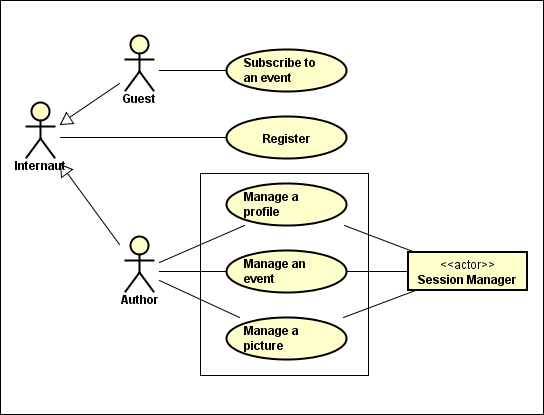

# **JavaEE website**

## Table of Contents

* [Overview](#overview)
	* [General Purpose](#general-purpose)
	* [Use case](#use-case)
	* [Data model](#data-model)
* [Getting Started](#getting-started)
* [Prerequisites](#prerequisites)
	* [The java development kit](#the-java-development-kit)
	* [The build automation tool](#the-build-automation-tool)
	* [The application server](#the-application-server)
* [Installing](#installing)
	* [Starting the server](#starting-the-server)
	* [Connection to the database](#connection-to-the-database)
	* [Connection to the mail box](#connection-to-the-mail-box)
* [Running](#running)
	* [Starting the database](#starting-the-database)
	* [Starting the server](#starting-the-server)
	* [Deployment](#deployment)
* [Testing](#testing)
	* [Manual test](#manual-test)
	* [Continuous integration](#continuous-integration)
* [Built With](#built-with)
* [Supported browsers](#supported-browsers)
* [Authors](#authors)
* [Acknowledgments](#acknowledgments)
* [License](#license)

## Overview

### General Purpose

The aim of this project is to provide a hand-coded JavaEE website. 
This website lets an author to create events and to invite some guests to subscribe to those events. Each author can register or login to the website with a password which will be hashed before being stored in a database.

### Use case

### Data model

## Getting Started

Clone the project into your workspace.

## Prerequisites

### The java development kit

Download the java development kit: jdk 1.8.0_111. 
Create an environment variable called JAVA_HOME pointing on the bin folder of the jdk. 
Add the variable to the Path.

### The build automation tool

Download the build automation tool: apache-maven-3.3.9-bin. 
Create an environment variable called MAVEN_HOME pointing on the bin folder of maven. 
Add the variable to the Path.

### The application server

Download the application server: wildfly-10.0.0.Final. 
Create an environment variable called JBOSS_HOME pointing on the bin folder of wildfly. 
Go to the bin folder of wildfly. 
Add a new user: 
* For Linux, run: `add-user.sh`
* For Windows, run: `add-user.bat`

## Installing

### Starting the server

Go to the bin folder of wildfly. 
* Launcher for Linux: `standalone.sh`
* Launcher for Windows: `standalone.bat`
* On a remote Linux server, use: `standalone.sh -b 0.0.0.0`

### Connection to the database

**create the database:**

<ul><li/>For Linux: 
In the shell, go to the folder /src/dataBase. 
Start MySQL: <code>sudo service mysql start</code>. 
Start the MySQL console: <code>mysql -u root -p</code>. 
Type the following commands:</li></ul>

	mysql> CREATE DATABASE website;
	mysql> USE website;
	mysql> SOURCE website.sql;
	mysql> quit;
<ul><li>For Windows: 
Download easyPHP and run it. 
Open the administration: http://127.0.0.1/home/. 
Then, open the administration module MySQL : PhpMyAdmin 4.1.4. 
Create a new database named website. 
Import the .sql file located into /src/dataBase.</li></ul>

**setup wildfly to connect to the database:**

Download the driver mysql-connector-java-5.1.4: https://dev.mysql.com/downloads/file/?id=465644. 
 **1.** Open the administration of wildfly: http://localhost:9990. 
 **2.** Go to "Deployments" and click on "Add". 
Upload a new deployment. 
Find mysql-connector-java-5.1.40-bin.jar. 
 **3.** Go to "Configuration", then "Subsystems", then "DataSources", then "Non-XA". Click on "Add". 
Choose DataSource: MySQL Datasource 
On step 1/3, set:

	Name: website
	JNDI Name: java:jboss/DataSources/website
On step 2/3 go to the tab "Detected Driver" and choose: mysql-connector-java-5.1.40-bin.jar_com.mysql.jdbc.Driver_5_1
On step 3/3, set:

	Connection URL: jdbc:mysql://localhost:3306/website
	Username: (yourDatabaseUsername)
	Password: (yourDatabasePassword)

### Connection to the mail box

**setup wildfly to connect to the mail box:**

Open the administration of wildfly: http://localhost:9990. 
 **1.** Go to "Configuration", then "Socket Binding" and click on "View". 
Click on "View>", then on "OutBound Remote", then on "Add" and set:

	Name: (what ever name you want, for ex: mail-smtp-gmail)
	Host: smtp.gmail.com
	Port: 465 (587 should work too)
*Save* 
 **2.** Go to "Configuration", then "Subsystems", then"Mail", click on "Add" and set:

	Name: java:jboss/mail/gmail
	JNDI Name: java:jboss/mail/gmail (name of the resource used in 'EmailObserver.java')
*Save* 
 Click on your Mail Session, then click on "View", then on "Add" and set:

	Socket Binding: (Socket Binding name, in our ex: mail-smtp-gmail)
	Type: smtp
	Username: (youremail@gmail.com)
	Password: (yourEmailPassword)
	Use SSL (tick)
*Save* 
 **3.** Restart wildfly (in the shell: "Ctrl+C", then [start the server](#starting-the-server "go to the 'starting the server' chapter")).

**setup your mail box to accept external applications:**

**1.** Authorize less secure applications to access to your email service (for Gmail, go [there](https://myaccount.google.com/lesssecureapps "Gmail webpage letting to activate/deactivate less secure application authorization")).

**2.** Check that the outgoing mails analysis is disable in your anti-virus.

## Running

### Starting the database

* For Linux: 
Start MySQL: `sudo service mysql start`.
* For Windows: 
Run easyPHP.

### Starting the server

Go to the bin folder of wildfly. 
* Launcher for Linux: `standalone.sh`
* Launcher for Windows: `standalone.bat`
On a remote server, use: `standalone.sh -b 0.0.0.0`

### Deployment

In the shell, go to the root folder of the java project, containing the pom.xml. 
Type the command: `mvn clean wildfly:deploy`

## Testing

### Manual test

After [running](#running "go to the 'running' chapter") the project, go to http://localhost:8080.

### Continuous integration

## Built With

### Structure

[Maven](https://maven.apache.org "Apache Maven website") - Build automation tool.

### Front-end

The front-end uses html, css and javascript.

### Back-end

Graphical User Interface: [Primefaces](http://www.primefaces.org "Primefaces website").
Template: Facelets
View/Web layer: [JSF (Java Server Faces)](http://www.oracle.com/technetwork/java/javaee/javaserverfaces-139869.html "JSF documentation on Oracle website").

### Persistence

Application programming interface/Domain layer/Relational data management: [JPA (Java Persistence API)](http://www.oracle.com/technetwork/java/javaee/tech/persistence-jsp-140049.html "JPA documentation on Oracle website").

## Supported browsers

This project have been manually tested with the following browsers:
* Chrome, Chromium
* Firefox
* IE 9 and 10
* Opera
* Safari

## Authors

* **Jérémy Pansier** - *Initial work* - [JeremyPansier](https://github.com/JeremyPansier "link to Jérémy's profile")

See also the list of [contributors](https://github.com/JeremyPansier/JavaEE_website/contributors "link to the contributors of the project") who participated in this project.

## Acknowledgments

* Special thanks to my brother Gwenall Pansier who helped me from my early days as developer.
* Thanks to Thomas Gros, the trainer who teached me basics in JavaEE.
* Thanks to Pascal Cunin, my schoolmate, with whom I started this project.

## License

[http://unlicense.org/](http://unlicense.org/)
